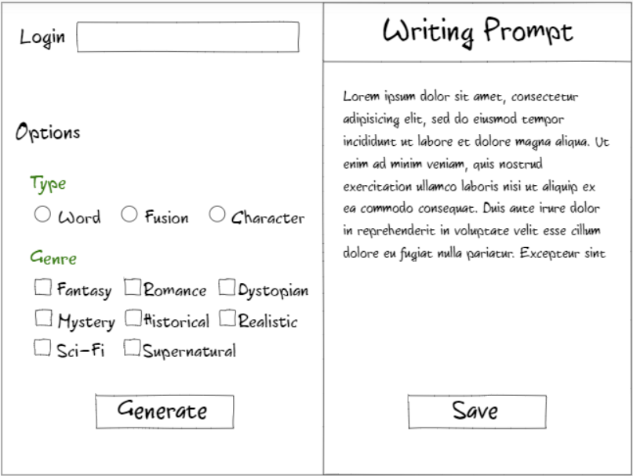
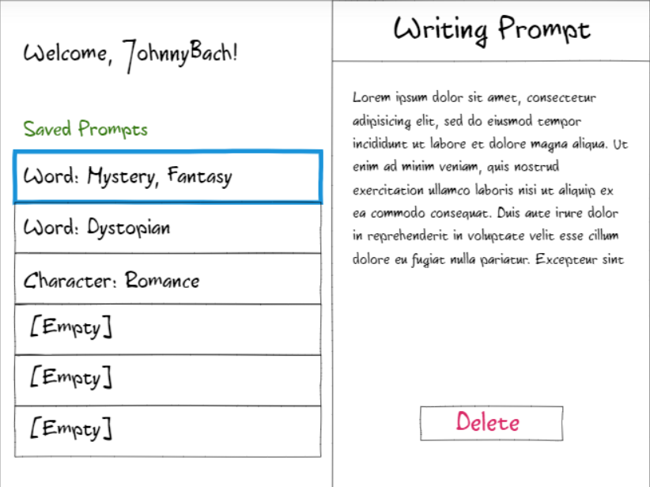

# startup
Startup application for CS 260 class

## Elevator Pitch
Writer's block keeping you from finishing your novel? Check out this prompt generating app, designed to put together random ideas and words to get creative juices flowing. Choose one of three generation types to get thought provoking words, fusions of words, and descriptions of characters. Filter prompt generation by genre to get a prompt closer to what you're looking for, and log in to save your favorite prompts for later stories. Who knows which prompt will inspire a best-selling novel?

## Design

## Key Features
* Save up to six favorite prompts through logging in 
* Generate unique prompts
* Filter by one or more genres
* Generate unique word combinations
* Generate unique character ideas
* Generate random, inspiring words from more than one language

## Technology
The following technologies will be used in the app:
* **Authentication --** to save prompts, users must login
* **Database data --** usernames and saved prompts are stored in the database
* **Websocket data --** share prompts with other users
* **HTML --** architecture/UX for the application
* **CSS --** impliment design/UI of application
* **Service --** backend service with endpoints for login, prompt generation, saving prompts, and retrieving prompts
* **Javascript --** provides login, prompt display, choice display, and backend endpoint calls 

## HTML Deliverable
For this deliverable, I built out the structure of my website using HTML. This was completed on 2/5/2024.
* **HTML pages --** Four HTML pages that represent login, generation, saved prompts, and information about the site.
* **Links --** The login page links to the generation page. Each page has a navigation bar allowing users to move easily between pages.
* **Text --** A description of the application is on the about page, and generated prompts are displayed through text.
* **Images --** An image is included on the about page. 
* **DB/Login --** Login draws from the database through an input box and button. Options on the generation page will change what information is drawn from the database. On the saved prompts page, buttons allow the user to get specific prompts from the database.
* **WebSocket --** Through the share button on the generation and saved prompts pages, the user can share prompts. 
