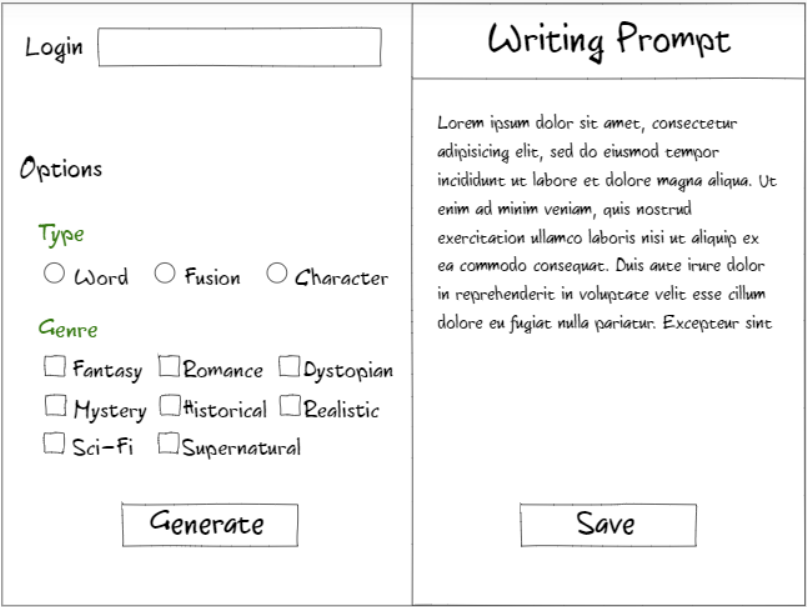
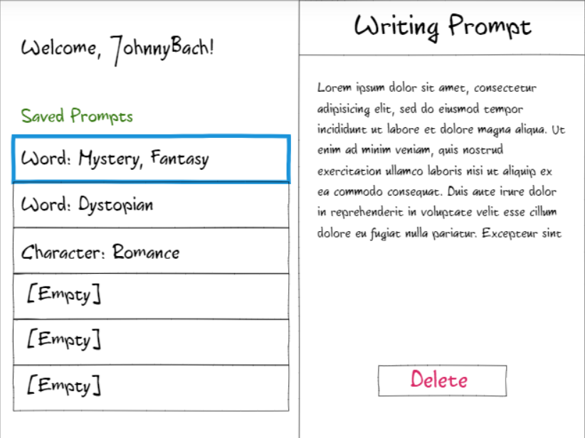

# startup
Startup application for CS 260 class

## Elevator Pitch
Writer's block keeping you from finishing your novel? Check out this prompt generating app, designed to put together random ideas and words to get creative juices flowing. Choose one of three generation types to get thought provoking words, fusions of words, and descriptions of characters. Filter prompt generation by genre to get a prompt closer to what you're looking for, and log in to save your favorite prompts for later stories. Who knows which prompt will inspire a best-selling novel?

## Design

## Key Features
* Save up to six favorite prompts through logging in 
* Generate unique prompts
* Filter by one or more genres
* Generate unique word combinations
* Generate unique character ideas
* Generate random, inspiring words from more than one language

## Technology
The following technologies will be used in the app:
* **Authentication --** to save prompts, users must login
* **Database data --** usernames and saved prompts are stored in the database
* **Websocket data --** share prompts with other users
* **HTML --** architecture/UX for the application
* **CSS --** impliment design/UI of application
* **Service --** backend service with endpoints for login, prompt generation, saving prompts, and retrieving prompts
* **Javascript --** provides login, prompt display, choice display, and backend endpoint calls 

## HTML Deliverable
For this deliverable, I built out the structure of my website using HTML. This was completed on 2/5/2024.
* **HTML pages --** There are four HTML pages that represent login, generation, saved prompts, and information about the site.
* **Links --** The login page links to the generation page. Each page has a navigation bar allowing users to move easily between pages.
* **Text --** A description of the application is on the about page, and generated prompts are displayed through text.
* **Images --** An image is included on the about page for some color.
* **DB/Login --** Login draws from the database through an input box and button. Options on the generation page will change what information is drawn from the database. On the saved prompts page, buttons allow the user to get specific prompts from the database.
* **WebSocket --** Through the share button on the generation and saved prompts pages, the user can share prompts. Shared prompts will appear in the user's saved prompts unless full. 
* **3rd Party Service Call --** Added generate button. When clicked, it will grab appropriate words through an API call to an online dictionary (perhaps Synonyms) to create a prompt.

## CSS Deliverable
For this deliverable, I formatted my website using CSS. This was completed on 2/14/2024.
* **Prerequisite: Simon CSS deployed to your production environment --** Completed. Use simon subdomain to access.
* **Prerequisite: A link to your GitHub startup repository prominently displayed on your application's home page --** Completed. In the footer on each page.
* **Prerequisite: At least 10 git commits spread consistently throughout the assignment period --** Completed. Feb 9 - 4 commits, Feb 10 - 3 commits, Feb 12 - 4 commits, Feb 13 - 4 commits, Feb 14 - 5 commits.
* **Properly styled CSS header, footer, and main content body --** Completed. All headers, footers, and main bodies were formatted with CSS.
* **Properly styled CSS navigation elements --** Completed. All pages include a bootstrap navigation bar in the header.
* **Responsive to window resizing --** Completed. All pages were formatted with flex boxes, so they respond to window resizing.
* **Properly styled CSS application elements --** Completed. Pages use buttons and cards to style application elements.
* **Properly styled CSS application text content --** Completed. All text is formatted using fonts, spacing, and size.
* **Properly styled CSS application images --** Completed. The image on the About page was formatted using a bootstrap class.

## JavaScript Deliverable
For this deliverable, I added functionailty to my website using JavaScript. This was completed on 3/2/2024.
* **Prerequisite: Simon JavaScript deployed to your production environment --** Completed. Use simon subdomain to access.
* **Prerequisite: A link to your GitHub startup repository prominently displayed on your application's home page --** Completed. In the footer on each page.
* **Prerequisite: Notes in your startup Git repository README.md file documenting what you modified and added with this deliverable --** Completed.
* **Prerequisite: At least 10 git commits spread consistently throughout the assignment period --** Completed. Feb 24 - 5 commits, Feb 25 - 1 commit, Feb 26 - 4 commits, Feb 27 - 7 commits, Feb 28 - 8 commits, Feb 29 - 2 commits, Mar 1 - 6 commits, Mar 2 - 2 commits.
* **JavaScript support for future login --** Completed. Placeholder in login.js
* **JavaScript support for future database data --** Completed. Placeholders in login.js, favorites.js, and share.js
* **JavaScript support for future WebSocket --** Completed. Placeholder in share.js
* **JavaScript support for your application's interaction logic --** Completed. Application can generate and favorite prompts, and the interaction logic for sharing prompts is supported by JavaScript. 

## Service Deliverable
For this deliverable, I added turned my application into a service and added calls to 3rd party services. This was completed on 3/18/2024.
* **Prerequisite: Simon Service deployed to your production environment --** Completed. Use simon subdomain to access.
* **Prerequisite: A link to your GitHub startup repository prominently displayed on your application's home page --** Completed. In the footer on each page.
* **Prerequisite: Notes in your startup Git repository README.md file documenting what you modified and added with this deliverable --** Completed.
* **Prerequisite: At least 10 git commits spread consistently throughout the assignment period --** Mar 9 - 5 commits, Mar 10 - 5 commits, Mar 12 - 2 commits, Mar 13 - 4 commits, Mar 14 - 1 commit, Mar 17 - 2 commits, Mar 18 - 3 commits, Mar 19 - 5 commits.
* **Create an HTTP service using Node.js and Express --** Completed. The application is now a service.
* **Frontend served up using Express static middleware --** Completed. Check out index.js
* **Your frontend calls third party service endpoints --** Completed. See the functions getRandomColor and getRandomPalette in generator.js
* **Your backend provides service endpoints --** Completed. See index.js for /favorites, /favorite, /receive, and /received.
* **Your frontend calls your service endpoints --** Completed. See login.js (import info from db) and generator.js, favorites.js, and share.js (export info to db).

## Login Deliverable
For this deliverable, I added login funtionality. This was completed on 3/24/2024.
* **Prerequisite: Simon Login deployed to your production environment --** Completed. Use simon subdomain to access.
* **Prerequisite: A link to your GitHub startup repository prominently displayed on your application's home page --** Completed. In the footer of each page.
* **Prerequisite: Notes in your startup Git repository README.md file documenting what you modified and added with this deliverable --** Completed.
* **Prerequisite: At least 10 git commits spread consistently throughout the assignment period --** Completed. Mar 20 - 1 commit, Mar 21 - 6 commits, Mar 22 - 3 commits, Mar 24 - 4 commits.
* **Supports new user registration --** Completed. See database.js, index.js, and login.js. 
* **Supports existing user authentication --** Completed. See database.js, index.js, and login.js. 
* **Stores application data in MongoDB --** Completed. See database.js. 
* **Stores and retrieves credentials in MongoDB --** Completed. See database.js. 
* **Restricts application functionality based upon authentication --** Completed. While the user can generate prompts without being logged in, they will not be able to save, share, or receive prompts. Share and Save buttons are disabled, and the link to favorites.html is removed from the navigation bar. 

## Websocket Deliverable
For this delieverable, I added websocket functionality on the share page. This was completed on 4/1/2024.
* **Prerequisite: Simon WebSocket deployed to your production environment --** Completed. Use simon subdomain to access.
* **Prerequisite: A link to your GitHub startup repository prominently displayed on your application's home page --** Completed. In the footer of each page.
* **Prerequisite: Notes in your startup Git repository README.md file documenting what you modified and added with this deliverable --** Completed.
* **Prerequisite: At least 10 git commits spread consistently throughout the assignment period --** Completed. Mar 26 - 2 commits, Mar 28 - 1 commit, Mar 29 - 2 commits, Mar 30 - 2 commits, Mar 31 - 2 commits, Apr 1 - 3 commits
* **Backend listens for WebSocket connection --** Completed. Check peerProxy.js.
* **Frontend makes WebSocket connection --** Completed. Check share.js in websocketSetup(). 
* **Data sent over WebSocket connection --** Completed. Check receive() and broadcastEvent() in share.js.
* **WebSocket data displayed in the application interface --** Completed. Check displayMsg() and loadReceivedButtons() in share.js. 